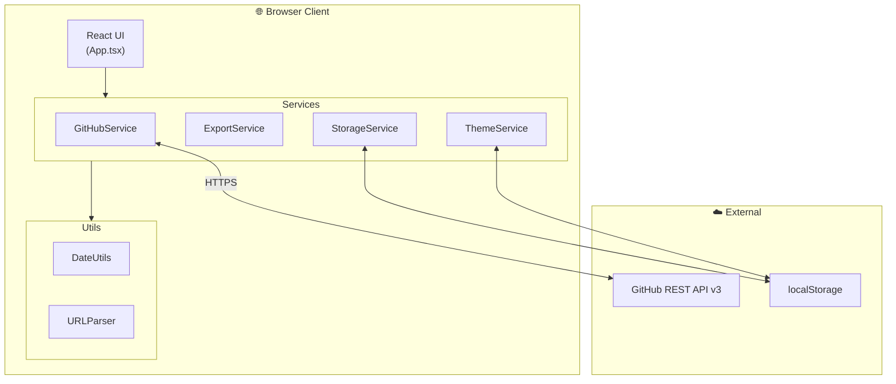
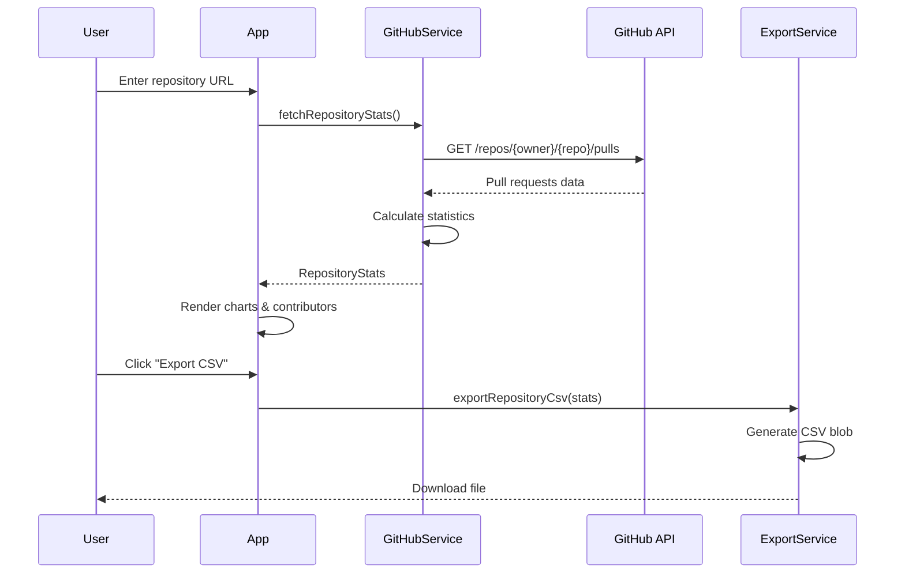
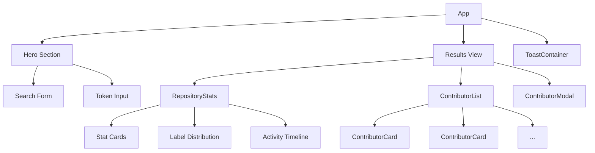

# 🔍 PR Analyzer

> **Comprehensive GitHub Pull Request analytics with contributor insights**

A modern, frontend-only React application that provides detailed insights into GitHub repository pull requests, contributor activity, and code metrics.


---

## ✨ Features

| Feature                     | Description                                    |
| --------------------------- | ---------------------------------------------- |
| 📊 **Repository Analytics** | Total PRs, merge rates, contributor counts     |
| 👥 **Contributor Insights** | Per-contributor statistics with avatars        |
| 📈 **Activity Timeline**    | Daily PR activity visualization                |
| 🏷️ **Label Distribution**   | PR labels breakdown                            |
| 🌿 **Branch Filtering**     | Filter PRs by target branch                    |
| ⏱️ **Time Filters**         | 2 weeks, 1 month, 3 months, 6 months, all time |
| 📥 **Export Options**       | CSV and JSON exports                           |
| 🌙 **Theme Support**        | Light and dark mode                            |

---

## 🏗️ Architecture



---

## 📂 Project Structure

```
frontend/
├── src/
│   ├── components/          # React UI components
│   │   ├── common/          # Shared: Loader, Toast, ErrorBoundary
│   │   ├── contributors/    # ContributorCard, ContributorList, Modal
│   │   ├── layout/          # Header, Footer, Sidebar
│   │   └── repository/      # RepositoryStats display
│   │
│   ├── services/            # Business logic layer
│   │   ├── GitHubService.ts # GitHub API integration
│   │   ├── ExportService.ts # CSV/JSON file exports
│   │   ├── StorageService.ts# Bookmarks & history
│   │   └── ThemeService.ts  # Dark/light mode
│   │
│   ├── utils/               # Utility functions
│   │   ├── dateUtils.ts     # Date manipulation
│   │   └── urlParser.ts     # GitHub URL parsing
│   │
│   ├── constants/           # Centralized configuration
│   │   └── index.ts
│   │
│   ├── types/               # TypeScript interfaces
│   │   └── index.ts
│   │
│   ├── styles/              # CSS styles
│   │   └── index.css
│   │
│   └── App.tsx              # Main application component
│
├── public/                  # Static assets
├── index.html               # HTML entry point
├── package.json
├── vite.config.ts
└── tsconfig.json
```

---

## 🔄 Data Flow



---

## 🚀 Getting Started

### Prerequisites

- Node.js 18+
- npm or yarn

### Installation

```bash
# Clone the repository
git clone https://github.com/your-username/pr-analyzer.git
cd pr-analyzer/frontend

# Install dependencies
npm install

# Start development server
npm run dev
```

### Using Docker

```bash
# Build and run with Docker Compose
docker compose up --build -d

# Access at http://localhost:5173
```

---

## ⚙️ Configuration

### GitHub Token (Optional)

For higher rate limits (5,000/hour vs 60/hour), add a GitHub Personal Access Token:

1. Go to [GitHub Settings → Tokens](https://github.com/settings/tokens)
2. Generate a new token (no scopes needed for public repos)
3. Enter the token in the app's token input section

> 🔒 The token is stored in your browser's localStorage, never sent to any server.

---

## 📊 Rate Limits

| Auth Status   | Rate Limit | Best For       |
| ------------- | ---------- | -------------- |
| Without Token | 60/hour    | Quick lookups  |
| With Token    | 5,000/hour | Heavy analysis |

---

## 🧩 Component Hierarchy



---

## 🛠️ Tech Stack

| Layer          | Technology                     |
| -------------- | ------------------------------ |
| **Framework**  | React 18 with TypeScript       |
| **Build Tool** | Vite                           |
| **Styling**    | Vanilla CSS with CSS Variables |
| **Icons**      | Lucide React                   |
| **API**        | GitHub REST API v3             |
| **Storage**    | Browser localStorage           |

---

## 📦 Scripts

```bash
npm run dev      # Start development server
npm run build    # Build for production
npm run preview  # Preview production build
npm run lint     # Run ESLint
```

---

## 🤝 Contributing

1. Fork the repository
2. Create your feature branch (`git checkout -b feature/amazing-feature`)
3. Commit your changes (`git commit -m 'Add amazing feature'`)
4. Push to the branch (`git push origin feature/amazing-feature`)
5. Open a Pull Request

---

## 📄 License

This project is open source and available under the [MIT License](LICENSE).

---

<div align="center">
  <p>Made with ❤️ for the open source community</p>
</div>
