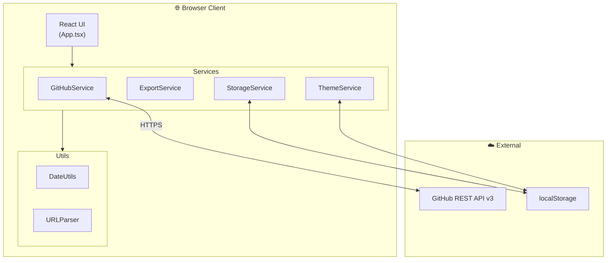
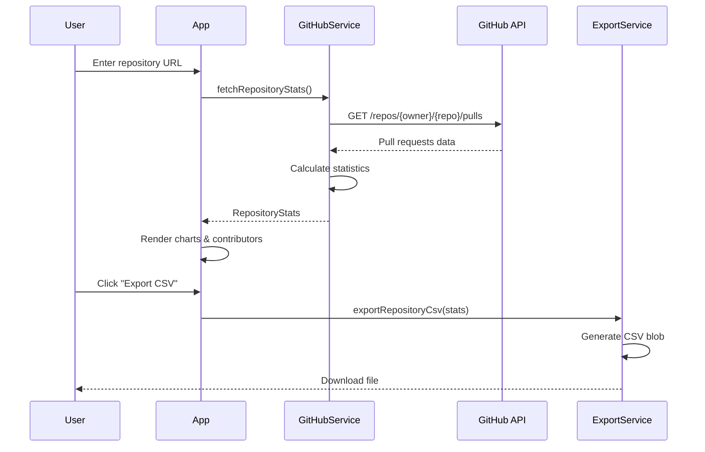
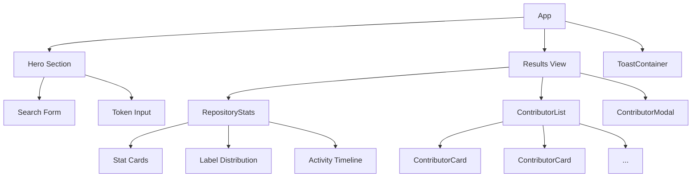

# �️ GSoC Espionage

> **GSoC 2026 Organizations Directory & GitHub PR Analytics Platform**

**Live at: [gsoc.app](https://gsoc.app)**

A comprehensive platform featuring a directory of all **185 organizations** participating in Google Summer of Code 2026 (including **22 new organizations**), plus powerful GitHub repository analytics for tracking pull requests, contributor activity, and code metrics. Built with React and deployed on AWS infrastructure.


---

## ✨ Features

### 🏢 GSoC 2026 Organizations
| Feature                           | Description                                        |
| --------------------------------- | -------------------------------------------------- |
| **185 Organizations Directory**   | Browse all GSoC 2026 participating organizations   |
| **Search & Filter**               | Find orgs by name, technology, or topic tags       |
| **Rich Organization Cards**       | Logo, tagline, description, tech stack, categories |
| **Direct Links**                  | Ideas lists, source code, contributor guides       |
| **Contact Information**           | Email, chat platforms, social media links          |
| **Lazy Loading**                  | ~450KB JSON data loaded on-demand at /orgs route  |

### 📊 Repository Analytics
| Feature                     | Description                                    |
| --------------------------- | ---------------------------------------------- |
| **PR Statistics**           | Total PRs, merge rates, contributor counts     |
| **Activity Timeline**       | Daily PR activity visualization with charts    |
| **Label Distribution**      | PR labels breakdown and categorization         |
| **Branch Filtering**        | Filter PRs by target branch                    |
| **Time Filters**            | 2 weeks, 1 month, 3 months, 6 months, all time |

### 👤 Contributor Insights
| Feature                     | Description                                    |
| --------------------------- | ---------------------------------------------- |
| **User Profile Analysis**   | Analyze GitHub user contributions across repos |
| **Contribution Heatmap**    | Calendar visualization of user activity        |
| **Per-Contributor Stats**   | Individual statistics with avatars             |
| **Repository Breakdown**    | Filter by repository and PR state              |

### ⚡ Performance & UX
| Feature                     | Description                                    |
| --------------------------- | ---------------------------------------------- |
| **Code Splitting**          | react-vendor, chart-vendor, icons bundles      |
| **Intelligent Caching**     | 5-30 min TTL per data type with CacheService   |
| **Lazy Loading**            | On-demand data fetching for better performance |
| **Bookmarks & History**     | Save repositories and search history           |
| **PWA Support**             | Progressive Web App with offline capabilities  |
| **Theme Support**           | Light/dark mode with system preference detect  |

### 📥 Export & Analytics
| Feature                     | Description                                    |
| --------------------------- | ---------------------------------------------- |
| **Export Options**          | RFC 4180 compliant CSV and JSON data export    |
| **Google Analytics 4**      | User behavior tracking and insights            |
| **Vercel Analytics**        | Performance monitoring                         |

---

## 🏢 GSoC 2026 Organizations Directory

Browse all **185 organizations** participating in Google Summer of Code 2026, including **22 brand new organizations**.

### Features
- **Search & Filter:** Find organizations by name, technology, or topic tags
- **Rich Cards:** Logo, tagline, description, tech stack, categories
- **Direct Links:** Ideas lists, source code, contributor guides, websites
- **Contact Info:** Email, chat platforms, social media
- **Lazy Loading:** ~450KB JSON data loaded on-demand at /orgs route

### Data Structure
Each organization includes name, logo, description, tech/topic tags, and comprehensive contact methods (email, chat, social media).

### SEO Optimization
The /orgs page is pre-rendered as static HTML during build for instant search engine indexing, with all 185 organization names embedded for discoverability.

---

## 👤 User Profile Analysis

Analyze GitHub user contributions across repositories with detailed insights:

- **Total Contributions:** PRs opened, merged, closed
- **Repository Breakdown:** Filter and group by repository
- **Activity Heatmap:** Contribution calendar visualization
- **PR Statistics:** Merge rates, review times, activity patterns
- **State Filtering:** Filter by PR state (open, merged, closed)

Perfect for tracking GSoC contributor activity and understanding contribution patterns over time.

---

## 🏗️ Architecture


```mermaid
flowchart TB
    subgraph Client["🌐 Browser Client"]
        UI["React UI<br/>(App.tsx)"]
        Services["Services Layer"]
        Utils["Utilities"]

        UI --> Services
        Services --> Utils
    end

    subgraph Services
        GH["GitHubService"]
        Export["ExportService"]
        Storage["StorageService"]
        Theme["ThemeService"]
    end

    subgraph Utils
        DateUtils["DateUtils"]
        URLParser["URLParser"]
    end

    subgraph External["☁️ External"]
        GitHubAPI["GitHub REST API v3"]
        LocalStorage["localStorage"]
    end

    GH <-->|"HTTPS"| GitHubAPI
    Storage <--> LocalStorage
    Theme <--> LocalStorage
```

---

## 📂 Project Structure

```
frontend/
├── src/
│   ├── components/          # React UI components
│   │   ├── common/          # Shared: Loader, Toast, ErrorBoundary
│   │   ├── contributors/    # ContributorCard, ContributorList, Modal
│   │   ├── layout/          # Header, Footer, Sidebar
│   │   ├── repository/      # RepositoryStats display
│   │   ├── user/            # UserAnalytics, UserContributions
│   │   └── orgs/            # GsocOrgs component (lazy-loaded)
│   │
│   ├── services/            # Business logic layer
│   │   ├── GitHubService.ts # GitHub API integration
│   │   ├── ExportService.ts # CSV/JSON file exports
│   │   ├── StorageService.ts# Bookmarks & history
│   │   ├── ThemeService.ts  # Dark/light mode
│   │   └── CacheService.ts  # localStorage-based caching with TTL
│   │
│   ├── utils/               # Utility functions
│   │   ├── dateUtils.ts     # Date manipulation
│   │   └── urlParser.ts     # GitHub URL parsing (supports multiple formats)
│   │
│   ├── constants/           # Centralized configuration
│   │   └── index.ts
│   │
│   ├── types/               # TypeScript interfaces
│   │   └── index.ts
│   │
│   ├── styles/              # CSS styles
│   │   └── index.css
│   │
│   └── App.tsx              # Main app with React Router integration
│
├── public/                  # Static assets
│   ├── manifest.json        # PWA manifest
│   ├── sitemap.xml          # SEO sitemap
│   └── robots.txt           # Search engine directives
│
├── scripts/                 # Build scripts
│   └── prerender-orgs.mjs   # Pre-render /orgs for SEO
│
├── index.html               # HTML entry point with SEO meta tags
├── package.json
├── vite.config.ts           # Code splitting & build config
└── tsconfig.json
```

---

## 🔄 Data Flow


```mermaid
sequenceDiagram
    participant User
    participant App
    participant GitHubService
    participant GitHub API
    participant ExportService

    User->>App: Enter repository URL
    App->>GitHubService: fetchRepositoryStats()
    GitHubService->>GitHub API: GET /repos/{owner}/{repo}/pulls
    GitHub API-->>GitHubService: Pull requests data
    GitHubService->>GitHubService: Calculate statistics
    GitHubService-->>App: RepositoryStats
    App->>App: Render charts & contributors

    User->>App: Click "Export CSV"
    App->>ExportService: exportRepositoryCsv(stats)
    ExportService->>ExportService: Generate CSV blob
    ExportService-->>User: Download file
```

---

## 🚀 Getting Started

### Prerequisites

- Node.js 18+
- npm or yarn

### Installation

```bash
# Clone the repository
git clone https://github.com/Ankitsinghsisodya/Gsoc-espionage.git
cd Gsoc-espionage/frontend

# Install dependencies
npm install

# Start development server
npm run dev
```

### Using Docker

```bash
# Build and run with Docker Compose
docker compose up --build -d

# Access at http://localhost:5173
```

---

## ☁️ Cloud Deployment

### Production Environment
- **Live URL:** [gsoc.app](https://gsoc.app)
- **Hosting:** AWS S3 (static files)
- **CDN:** AWS CloudFront with custom functions
- **CI/CD:** GitHub Actions (auto-deploy on push to main)

### Cache Strategy
- **Hashed Assets** (JS/CSS): 31,536,000 seconds (1 year cache)
- **HTML Files:** no-cache (always fresh routing)
- **API Responses:** 5-30 minutes (configurable TTL per data type)

### Deployment Pipeline
1. Push to `main` triggers GitHub Actions
2. Install dependencies (`npm ci`)
3. Build TypeScript + Vite bundle
4. Prerender /orgs page with all 185 org names
5. Sync assets to S3 with long-term cache headers
6. Upload HTML with no-cache headers
7. Deploy CloudFront Function for SPA routing
8. Invalidate CloudFront cache

See `.github/workflows/deploy.yml` for full pipeline configuration.

---

## ⚙️ Configuration

### GitHub Token (Optional)

For higher rate limits (5,000/hour vs 60/hour), add a GitHub Personal Access Token:

1. Go to [GitHub Settings → Tokens](https://github.com/settings/tokens)
2. Generate a new token (no scopes needed for public repos)
3. Enter the token in the app's token input section

> 🔒 The token is stored in your browser's localStorage, never sent to any server.

### Supported URL Formats

The URL parser supports multiple GitHub URL formats:

| Format    | Example                                  |
| --------- | ---------------------------------------- |
| Simple    | `facebook/react`                         |
| Domain    | `github.com/owner/repo`                  |
| Full URL  | `https://github.com/owner/repo`          |
| With .git | `https://github.com/owner/repo.git`      |
| SSH       | `git@github.com:owner/repo.git`          |
| PR URLs   | `https://github.com/owner/repo/pull/123` |

```typescript
import { GitHubUrlParser, extractPRNumber } from "./utils";

// Parse any format
GitHubUrlParser.parse("git@github.com:facebook/react.git");
// → { owner: 'facebook', repo: 'react' }

// Extract PR number from URL
extractPRNumber("https://github.com/owner/repo/pull/456");
// → 456
```

---

## 📊 Rate Limits

| Auth Status   | Rate Limit | Best For       |
| ------------- | ---------- | -------------- |
| Without Token | 60/hour    | Quick lookups  |
| With Token    | 5,000/hour | Heavy analysis |

---

## 🧩 Component Hierarchy


```mermaid
graph TD
    App["App"]

    App --> Hero["Hero Section"]
    App --> Results["Results View"]
    App --> Toast["ToastContainer"]

    Hero --> SearchForm["Search Form"]
    Hero --> TokenInput["Token Input"]

    Results --> RepoStats["RepositoryStats"]
    Results --> ContribList["ContributorList"]
    Results --> Modal["ContributorModal"]

    ContribList --> Card1["ContributorCard"]
    ContribList --> Card2["ContributorCard"]
    ContribList --> CardN["..."]

    RepoStats --> StatCards["Stat Cards"]
    RepoStats --> Labels["Label Distribution"]
    RepoStats --> Timeline["Activity Timeline"]
```

---

## 🛠️ Tech Stack

| Layer            | Technology                                  |
| ---------------- | ------------------------------------------- |
| **Framework**    | React 18 with TypeScript                    |
| **Build Tool**   | Vite 5.0 with code splitting                |
| **Routing**      | React Router DOM 6.21.1                     |
| **Styling**      | Vanilla CSS + Tailwind CSS 3.4              |
| **Charts**       | Recharts 2.10, React Calendar Heatmap 1.9.0 |
| **Icons**        | Lucide React                                |
| **SEO**          | React Helmet Async 2.0.5, JSON-LD           |
| **API**          | GitHub REST API v3                          |
| **Storage**      | Browser localStorage with TTL caching       |
| **Analytics**    | Google Analytics 4, Vercel Analytics        |
| **Deployment**   | AWS S3 + CloudFront, GitHub Actions CI/CD   |
| **Performance**  | Code splitting, lazy loading, long-term caching |

---

## ⚡ Performance & Optimization

### Code Splitting
- **react-vendor:** React, React DOM, React Router (~200KB)
- **chart-vendor:** Recharts, D3 dependencies (~150KB)
- **icons:** Lucide React (~50KB)
- Reduces initial bundle size by 82% with lazy-loaded /orgs data

### Caching Strategy
- **CacheService:** localStorage-based with TTL
  - User profiles: 10 minutes
  - Repository stats: 5 minutes
  - Branch lists: 30 minutes
- **CloudFront:** Long-term caching for versioned assets (1 year)
- **HTML:** No-cache strategy for fresh SPA routing

### Lazy Loading
- GSoC Organizations data (~450KB) loads only when viewing /orgs route
- Route-based code splitting for optimal initial load performance
- On-demand component loading for better resource management

---

## 🔍 SEO & Analytics

### Search Engine Optimization
- **Prerendering:** /orgs page pre-rendered with all 185 org names
- **Structured Data:** JSON-LD schemas (WebApplication, Dataset, FAQPage)
- **Meta Tags:** Open Graph, Twitter Cards, comprehensive keywords
- **Sitemap:** XML sitemap at /sitemap.xml
- **Robots.txt:** Search engine directives
- **Canonical URLs:** All pages have canonical tags

### Analytics
- **Google Analytics 4:** User behavior tracking, page views, events
- **Vercel Analytics:** Performance monitoring, Core Web Vitals

---

## 📦 Scripts

```bash
npm run dev      # Start development server
npm run build    # Build for production
npm run preview  # Preview production build
npm run lint     # Run ESLint
```

---

## 🤝 Contributing

1. Fork the repository
2. Create your feature branch (`git checkout -b feature/amazing-feature`)
3. Commit your changes (`git commit -m 'Add amazing feature'`)
4. Push to the branch (`git push origin feature/amazing-feature`)
5. Open a Pull Request

---

## 📄 License

This project is open source and available under the [MIT License](LICENSE).

---

<div align="center">
  <p>Made with ❤️ for the open source community</p>
</div>
